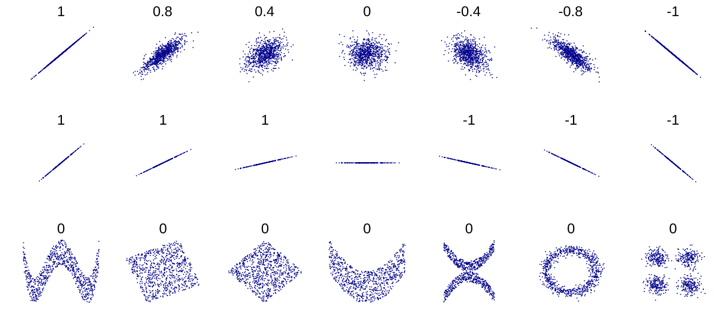
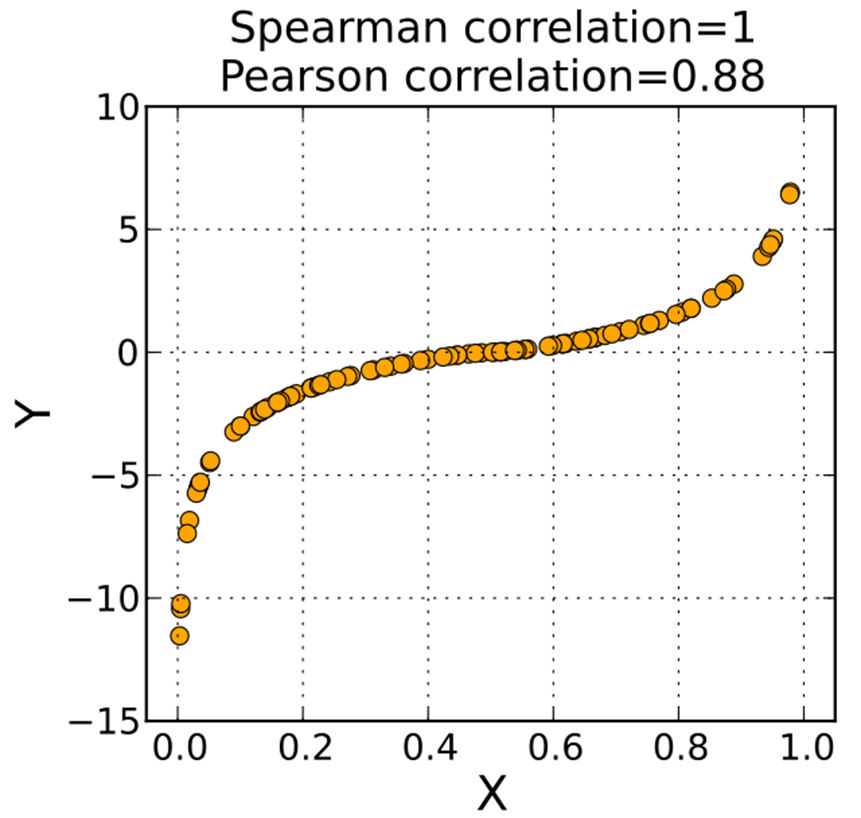
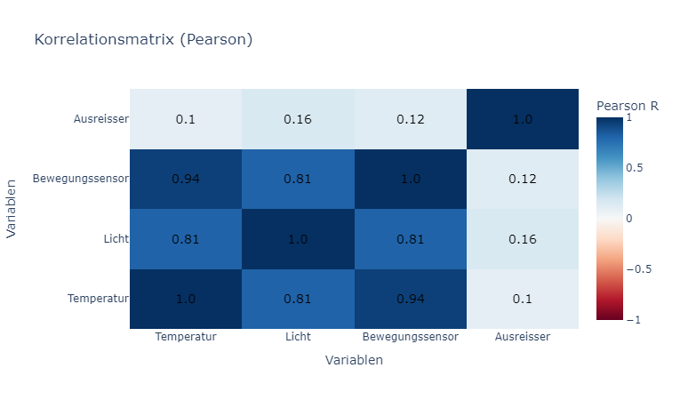
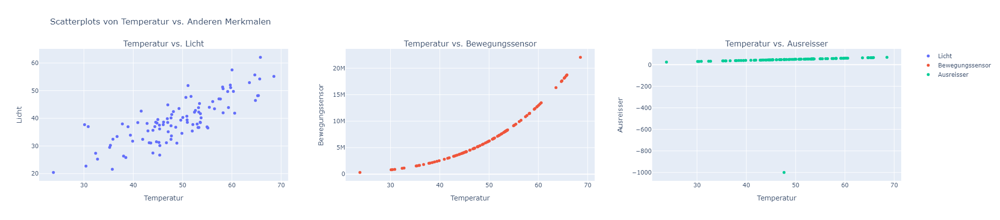

## Korrelationen

Korrelationen messen den **Zusammenhang** zwischen zwei numerischen Variablen und drücken ihn als **Korrelationskoeffizient** $R$ aus. Wenn Sie ein intuitives Gefühl dafür entwickeln möchten, wie Korrelationskoeffizienten mit den Daten zusammenhängen, dann spielen Sie [Guess the Correlation](https://www.guessthecorrelation.com/) (gratis). 

### 1. Korrelationskoeffizient $R$

* **Wertebereich:** $-1 \le R \le 1$
* $R > 0$: positiver Zusammenhang (steigt X, steigt Y)
* $R < 0$: negativer Zusammenhang (steigt X, fällt Y)
* $R == 0$: kein Zusammenhang (X und Y sind unabhängig voneinander)
* $|R| > 0.8$: starke Korrelation
* $|R|$ zwischen $0.5$ und $0.8$: moderate Korrelation
* $|R| < 0.5$: schwache Korrelation

> **Wichtig:** Korrelation ≠ Kausalität!
> Ein hoher Korrelationswert zeigt nur, dass zwei Variablen simultan variieren, aber nicht, dass die eine die Ursache der anderen ist oder umgekehrt.
> Wie die Korrelation zu interpretieren ist, findet man am besten heraus, indem man sich die Frage stellt:
> Wieso würde die Messreihe X eine Wirkung in der Messreihe Y oder umgekehrt ergeben? Gibt es eine weitere dritte Variable die die Ursache für X und Y sein könnte?


In der unterstehenden Grafik sind verschiedene Korrelationskoeffizienten (Pearson) und die dazugehörigen Daten zu sehen. Es ist gut ersichtlich, dass die Steigung der Daten keinen Einfluss auf die Korrelationskoeffizienten hat (Reihe 2).



---

### 2. Pearson vs. Spearman

Es gibt viele Arten von Korrelationen. Hauptsächlich werden aber zwei Methoden angewendet: die Pearson-Korrelation und die Spearman-Korrelation.

Die Pearson-Korrelation ist simple und kann verwendet werden, um lineare Zusammenhänge zu messen. 

Was aber, wenn ein Zusammenhang nicht linear ist, zum Beispiel quadrilinear, quadratisch oder exponentiell? In diesem Fall kann die Pearson-Korrelation dies nicht mehr messen, und hier verwendet man die Spearman-Korrelation. 

Ausserdem ist die Spearman-Korrelation fast nicht anfällig gegenüber Ausreissern. 

| Merkmal                | Pearson | Spearman                             |
| ---------------------- | ------- | ------------------------------------ |
| Zusammenhangstyp       | Linear  | Monoton (beliebig nicht-linear)      |
| Sensitivität Ausreisser | Hoch    | Gering (robust gegenüber Ausreissern) |

* **Pearson** misst die **lineare** Abhängigkeit.
* **Spearman** misst, ob eine **monotone** Beziehung vorliegt, und ist robuster gegenüber Ausreissern und nicht-linearen Mustern.

In der nachfolgenden Grafik ist noch einmal klar dargestellt, was mit einer linearen Abhängigkeit und einer monotonen Beziehung gemeint ist. 

Hier sind die Daten nicht linear abhängig, haben jedoch eine monotone Beziehung (Y erhöht sich IMMER wenn sich X erhöht und umgekehrt). 



---

### 3. Beispielcode (Pseudodaten)

```python
import numpy as np
import pandas as pd

# Pseudodaten erzeugen
np.random.seed(42)
x = np.random.normal(loc=50, scale=10, size=100)
y_linear = 0.8 * x + np.random.normal(scale=5, size=100)    # überwiegend linear
y_nonlinear = x**4 # monotone, nicht-linear
y_ausreisser = x.copy()
y_ausreisser[-1] = -1000 # Ausreisser


df = pd.DataFrame({'Temperatur': x, 'Licht': y_linear, 'Bewegungssensor': y_nonlinear, 'Ausreisser': y_ausreisser})

# Pearson-Korrelation
print("Pearson R:")

# Pandas berechnet standardmässig die Pearson-Korrelation
print(df.corr())

# Spearman-Korrelation
print("Spearman R:")
print(df.corr(method="spearman"))

# Die Korrelationsmatrix lässt sich auch visualisieren
# Pearson-Korrelation
pearson_corr = df.corr().round(2)
pearson_text = pearson_corr.astype(str)

fig_pearson = go.Figure(data=go.Heatmap(
    z=pearson_corr.values,
    x=pearson_corr.columns,
    y=pearson_corr.columns,
    text=pearson_text.values,
    texttemplate="%{text}",
    textfont={"size":14, "color":"black"},
    colorscale='RdBu',
    zmin=-1,
    zmax=1,
    colorbar=dict(title="Pearson R")
))

fig_pearson.update_layout(
    title="Korrelationsmatrix (Pearson)",
    xaxis_title="Variablen",
    yaxis_title="Variablen"
)

fig_pearson.show()
```

**Ausgabe:**
```txt
Pearson R:
                 Temperatur     Licht  Bewegungssensor  Ausreisser
Temperatur         1.000000  0.813799         0.944682    0.100723
Licht              0.813799  1.000000         0.810350    0.155170
Bewegungssensor    0.944682  0.810350         1.000000    0.118911
Ausreisser         0.100723  0.155170         0.118911    1.000000

Spearman R:
                 Temperatur     Licht  Bewegungssensor  Ausreisser
Temperatur         1.000000  0.787855         1.000000    0.988647
Licht              0.787855  1.000000         0.787855    0.792439
Bewegungssensor    1.000000  0.787855         1.000000    0.988647
Ausreisser         0.988647  0.792439         0.988647    1.000000
```




**Erwartete Ergebnisse:**

* Pearson R (linear: Temperatur~Licht) ≈ 0.81 → starke lineare Korrelation
* Spearman R (nicht-linear: Temperatur~Bewegungssensor) ≈ 1 → perfekte Korrelation statt nur 0.94
* Spearman R (ausreisser: Temperatur~Ausreisser) ≈ 0.989 → Der Ausreisser hat keinen Einfluss auf den Korrelationskoeffizienten. Pearson R ist nur 0.1.

Diese Ergebnisse lassen sich auch noch visuell überporüfen:

```python
fig = make_subplots(rows=1, cols=3, subplot_titles=('Temperatur vs. Licht', 'Temperatur vs. Bewegungssensor', 'Temperatur vs. Ausreisser'))

fig.add_trace(go.Scatter(x=df['Temperatur'], y=df['Licht'], mode='markers', name='Licht'), row=1, col=1)
fig.update_xaxes(title_text='Temperatur', row=1, col=1)
fig.update_yaxes(title_text='Licht', row=1, col=1)

fig.add_trace(go.Scatter(x=df['Temperatur'], y=df['Bewegungssensor'], mode='markers', name='Bewegungssensor'), row=1, col=2)
fig.update_xaxes(title_text='Temperatur', row=1, col=2)
fig.update_yaxes(title_text='Bewegungssensor', row=1, col=2)

fig.add_trace(go.Scatter(x=df['Temperatur'], y=df['Ausreisser'], mode='markers', name='Ausreisser'), row=1, col=3)
fig.update_xaxes(title_text='Temperatur', row=1, col=3)
fig.update_yaxes(title_text='Ausreisser', row=1, col=3)

fig.update_layout(title_text='Scatterplots von Temperatur vs. Anderen Merkmalen')
fig.show()
```



---

### 4. Interpretation

* **R nahe ±1**: sehr starker Zusammenhang
* **R nahe 0**: kein oder sehr schwacher Zusammenhang
