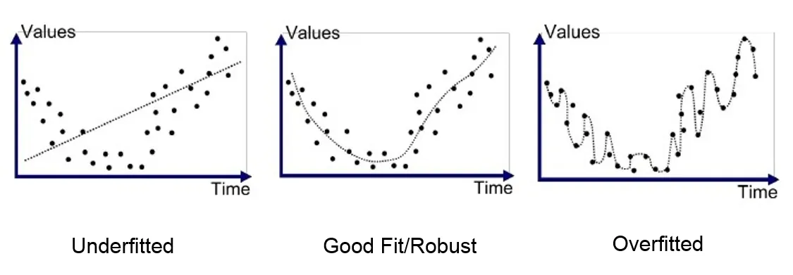

# Modellevaluation

## Was ist ein Train-Test Split?

Der **Train-Test Split** ist eine fundamentale Methode im Machine Learning, bei der der Datensatz in zwei Teile aufgeteilt wird:

- **Trainingsdaten**: Werden verwendet, um das Modell zu trainieren
- **Testdaten**: Werden verwendet, um die Leistung des Modells zu bewerten

Diese Aufteilung ist essentiell, um zu beurteilen, wie gut ein Modell auf **neue, unbekannte Daten** reagiert.

## Warum ist Train-Test Split wichtig?

Ohne Train-Test Split würden wir das Modell auf denselben Daten trainieren und bewerten. Das führt zu **unrealistisch guten Ergebnissen**, da das Modell die Trainingsdaten bereits "kennt". Mit einem Train-Test Split können wir **Overfitting** erkennen und die tatsächliche Leistung des Modells einschätzen.

## Overfitting und Underfitting verstehen


/// caption
https://medium.com/greyatom/what-is-underfitting-and-overfitting-in-machine-learning-and-how-to-deal-with-it-6803a989c76
///

### Was ist Overfitting?
**Overfitting** tritt auf, wenn ein Modell die Trainingsdaten zu genau lernt, einschliesslich des Rauschens. Das Modell funktioniert sehr gut auf den Trainingsdaten, aber schlecht auf neuen Daten.

**Anzeichen für Overfitting:**

- Sehr niedriger Training MSE, aber hoher Test MSE
- Grosse Differenz zwischen Training- und Test-Performance

### Was ist Underfitting?
**Underfitting** tritt auf, wenn ein Modell zu einfach ist und die zugrunde liegenden Muster in den Daten nicht erfassen kann.

**Anzeichen für Underfitting:**

- Hoher Training MSE und hoher Test MSE
- Beide Werte sind ähnlich, aber beide schlecht

### Overfitting vs. Underfitting

| Problem              | Training MSE | Test MSE          | Lösung                          |
|----------------------|--------------|-------------------|---------------------------------|
| **Perfekte Balance** | Niedrig      | Niedrig (ähnlich) | ✅ Ideal                         |
| **Overfitting**      | Sehr niedrig | Hoch              | Modell vereinfachen, mehr Daten |
| **Underfitting**     | Hoch         | Hoch (ähnlich)    | Komplexeres Modell verwenden    |


## Implementierung des Train-Test Splits

```python
# 80% der Daten für Training auswählen
train_data = data.sample(frac=0.8, random_state=42)
# Restliche 20% für Test
test_data = data.drop(train_data.index)

# Features und Target aufteilen
X_train = train_data[['time']]
y_train = train_data['temperature']
X_test = test_data[['time']]
y_test = test_data['temperature']
```

### Typische Aufteilungen

| Datensatzgrösse    | Empfohlene Aufteilung  | Begründung                                       |
|-------------------|------------------------|---------------------------------------------------|
| < 1000 Punkte     | 70-80% Training        | Mehr Daten für Training bei kleinen Datensätzen   |
| 1000-10000 Punkte | 80% Training, 20% Test | Standard-Aufteilung                               |
| > 10000 Punkte    | 90% Training, 10% Test | Bei grossen Datensätzen reichen weniger Testdaten |

## Modell trainieren und evaluieren

### 1. Modell auf Trainingsdaten trainieren
```python
from sklearn.linear_model import LinearRegression

# Modell erstellen und trainieren
model = LinearRegression()
model.fit(X_train, y_train)  # NUR Trainingsdaten verwenden!
```

### 2. Modell auf Testdaten evaluieren
```python
# Vorhersagen auf Testdaten machen
y_pred = model.predict(X_test)

# MSE manuell berechnen mit Residuen
residuals = y_test - y_pred
test_mse = (residuals ** 2).mean()
print(f"Test MSE: {test_mse}")
```


