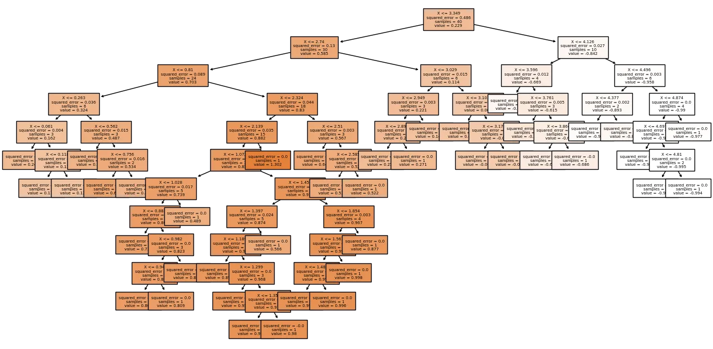
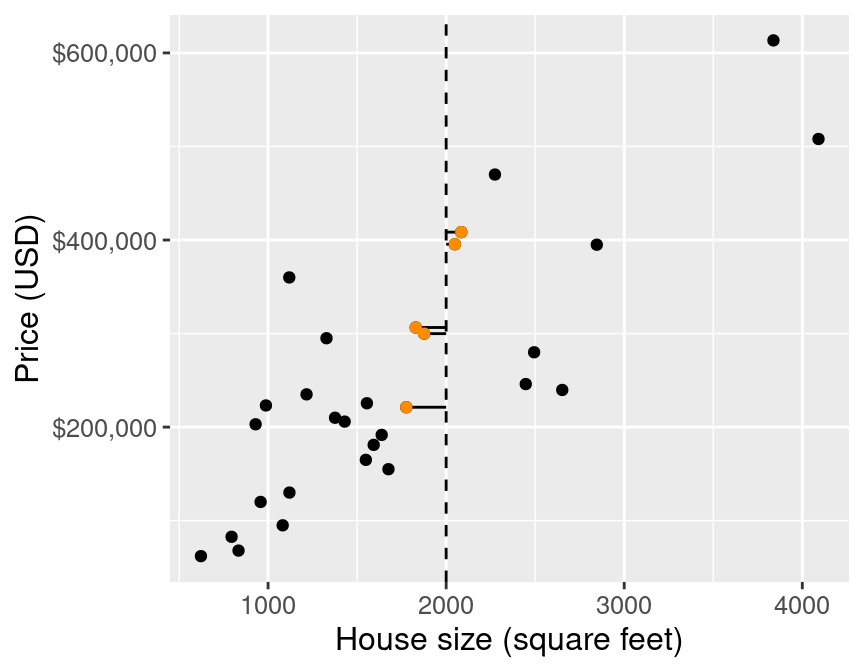

# Weitere Regressionen

## Decision Tree Regressor

### Was ist ein Decision Tree Regressor?
Der **Decision Tree Regressor** ist ein Modell, das Entscheidungen durch eine Baumstruktur trifft. Anstatt eine gerade Linie wie bei der linearen Regression zu finden, teilt der Decision Tree die Daten in verschiedene Bereiche auf und macht für jeden Bereich eine separate Vorhersage.


/// caption
https://medium.com/berk-hakbilen/decision-trees-in-mexplained-a092e387e4aa
///

### Wie funktioniert ein Decision Tree Regressor?
Der Algorithmus erstellt einen Baum von Entscheidungen, indem er die Daten schrittweise in kleinere Gruppen aufteilt. Jeder Knoten im Baum stellt eine Entscheidung dar (z.B. "Ist x > 5?"), und die Blätter enthalten die finalen Vorhersagewerte.

### Implementierung des Decision Tree Regressors
```python
from sklearn.tree import DecisionTreeRegressor

model = DecisionTreeRegressor(max_depth=5)  # Begrenzt die Tiefe des Baums
X = data[['x']]
y = data['y']
model.fit(X, y)

# Vorhersage
predictions = model.predict(X)
```

### Wichtiger Parameter: max_depth
Der Parameter `max_depth` begrenzt die maximale Tiefe des Baums:

- **Niedrige Werte** (z.B. 2-5): Einfacheres Modell, weniger Overfitting
- **Hohe Werte** (z.B. 10+): Komplexeres Modell, kann zu Overfitting führen
- **None**: Unbegrenzte Tiefe (Vorsicht vor Overfitting!)

## K-Nearest Neighbors Regressor

### Was ist ein K-Nearest Neighbors Regressor?
Der **K-Nearest Neighbors (KNN) Regressor** macht Vorhersagen basierend auf den **k nächstgelegenen Datenpunkten**. Für einen neuen Punkt betrachtet das Modell die k ähnlichsten Punkte aus den Trainingsdaten und berechnet deren Durchschnitt.

{ width="500" }
/// caption
https://datasciencebook.ca/regression1.html#overview-6
///

### Wie funktioniert ein KNN Regressor?

1. Für einen neuen Datenpunkt werden die k nächstgelegenen Nachbarn in den Trainingsdaten gefunden
2. Der Vorhersagewert wird als Durchschnitt der y-Werte dieser k Nachbarn berechnet
3. Je näher ein Nachbar ist, desto mehr Einfluss hat er auf die Vorhersage

### Implementierung des KNN Regressors
```python
from sklearn.neighbors import KNeighborsRegressor

model = KNeighborsRegressor(n_neighbors=5)  # Verwendet 5 nächste Nachbarn
X = data[['x']]
y = data['y']
model.fit(X, y)

# Vorhersage
predictions = model.predict(X)
```

### Wichtiger Parameter: n_neighbors
Der Parameter `n_neighbors` bestimmt, wie viele Nachbarn berücksichtigt werden:

- **Niedrige Werte** (z.B. 1-3): Sehr flexibles Modell, kann zu Overfitting führen
- **Hohe Werte** (z.B. 10+): Glatteres Modell, weniger sensitiv für einzelne Datenpunkte