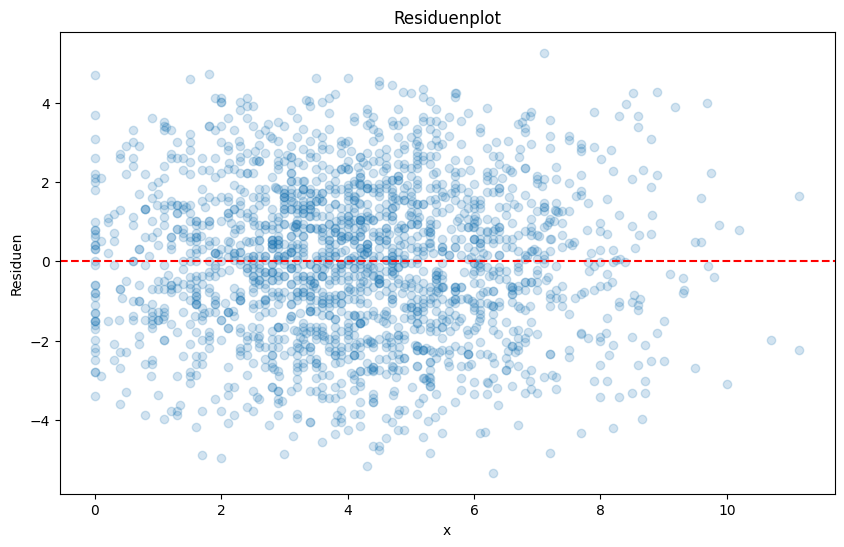

# Residuenanalyse: Überprüfung der Modellannahmen mittels Residuenplot

Die Residuenanalyse hilft sicherzustellen, dass die Annahmen eines linearen Regressionsmodells korrekt sind. Ein **Residuenplot** ist ein einfaches und effektives Werkzeug, um diese Annahmen visuell zu überprüfen.

## Wichtige Annahmen der Residuen

In einer linearen Regression gibt es drei grundlegende Annahmen bezüglich der Residuen:

### Normalverteilung der Residuen

Die Residuen sollten **normalverteilt** sein, damit die statistischen Tests und Schätzungen zuverlässig sind.

**Überprüfung**: Ein **Residuenplot** kann zeigen, ob die Residuen zufällig verteilt sind. Wenn die Residuen zufällig um die Null-Achse schwanken und keine Muster aufweisen, sind sie vermutlich normalverteilt.

### Erwartungswert von 0

Der Mittelwert der Residuen sollte **null** sein, was darauf hinweist, dass das Modell im Durchschnitt keine systematischen Fehler macht.

**Überprüfung**: Im **Residuenplot** sollte die Verteilung der Residuen um die Null-Achse zufällig verteilt sein. Wenn die Residuen systematisch über oder unter der Null-Achse liegen, könnte der Mittelwert der Residuen von Null abweichen.

### Unabhängigkeit der Residuen

Die Residuen sollten **unabhängig** voneinander sein, d. h. der Fehler eines Datenpunkts sollte nicht vom Fehler eines anderen abhängen.

**Überprüfung**: Wenn die Residuen im **Residuenplot** ein Muster (z. B. eine Kurve) zeigen, könnte dies auf eine Abhängigkeit zwischen den Fehlern hinweisen.

## Beispiel eines Residuenplots

Hier ist ein einfaches Beispiel, ein Residuenplot zu erstellen, um die oben genannten Annahmen zu überprüfen.

```python
data['residuals'] = data['y'] - model.predict(data[['x']])
plt.scatter(data['x'], data['residuals'])
plt.axhline(0, color='red', linestyle='--')
plt.title('Residuenplot')
plt.xlabel('x')
plt.ylabel('Residuen')
plt.show()
```



In diesem Beispiel sehen wir, dass die meisten Residuen um die Null-Achse verteilt sind und keine klaren Muster aufweisen. Dies deutet darauf hin, dass die Annahmen der Normalverteilung, des Mittelwerts von 0 und der Unabhängigkeit der Residuen erfüllt sind.