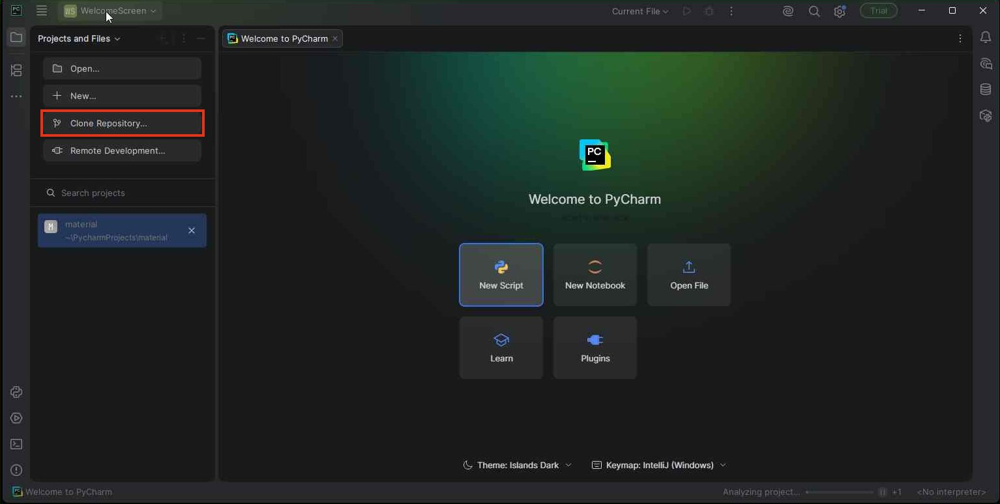
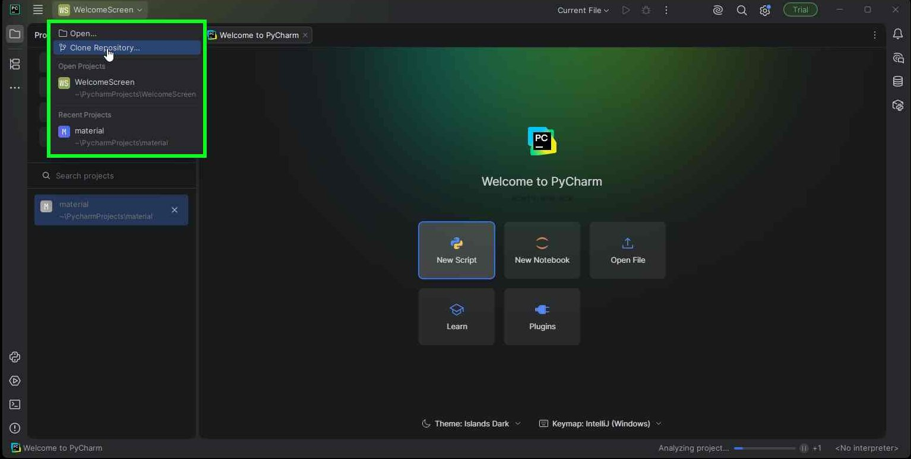
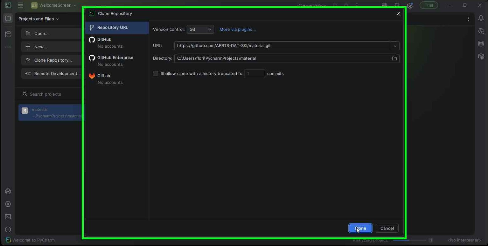
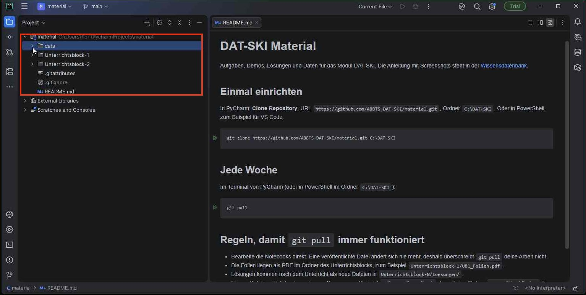
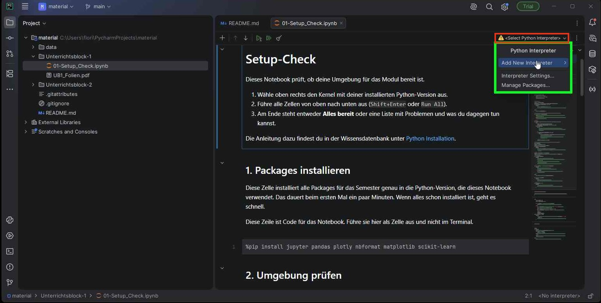
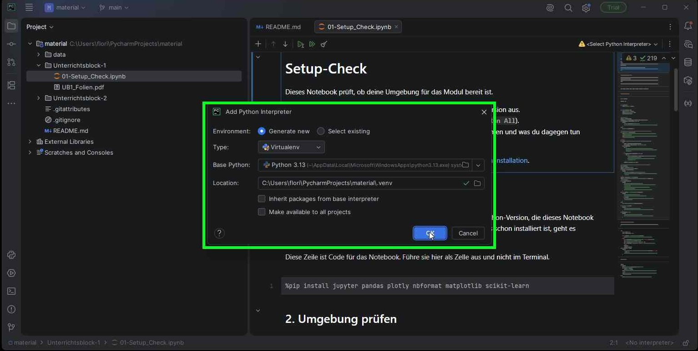
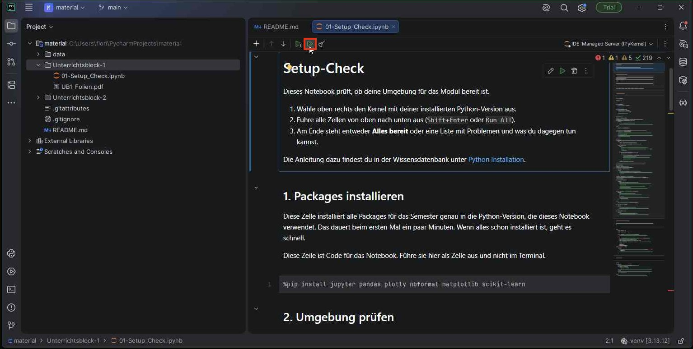
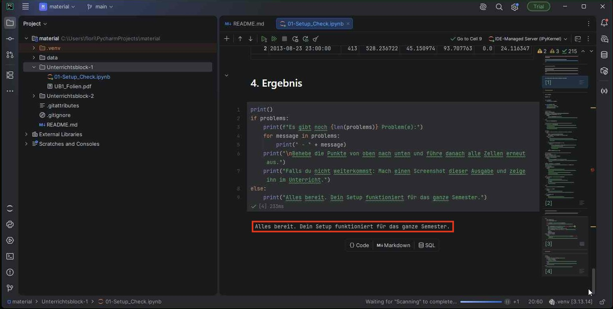

# Setup: Python, Git und PyCharm

Python, Git und PyCharm kennst du aus dem letzten Modul. Diese Seite zeigt deshalb nur kurz, was du prüfen musst, und dann genau, wie du das Material in PyCharm holst und den Setup-Check ausführst.

**Bis zum zweiten Unterricht muss der Setup-Check «Alles bereit» melden.** Ab dann arbeiten wir in jeder Lektion mit Python. Bei Problemen schreib mir auf Teams oder frag die IT deiner Firma (Rechte, Firewall, Firmenlaptop).

Kurzfassung:

1. Python 3.x ist installiert (empfohlen 3.13).
2. Git ist installiert.
3. Lange Pfade sind in Windows erlaubt.
4. In PyCharm **Clone Repository** mit `https://github.com/ABBTS-DAT-SKI/material.git`.
5. `Unterrichtsblock-1/01-Setup_Check.ipynb` öffnen, Interpreter erstellen, **Run All**.

## 1. Python

Öffne PowerShell (Startmenü → `PowerShell`) und prüfe:

```sh
python --version
```

Erscheint `Python 3.12` oder neuer, bist du fertig. Sonst installiere [Python 3.13 von python.org](https://www.python.org/downloads/release/python-31316/) (`Windows installer (64-bit)`) und aktiviere im Installer `Add python.exe to PATH`.

## 2. Git

```sh
git --version
```

Erscheint eine Versionsnummer, bist du fertig. Sonst installiere [Git for Windows](https://git-scm.com/downloads/win) mit den Standardeinstellungen und öffne PowerShell neu.

## 3. Lange Pfade in Windows erlauben

Windows erlaubt standardmässig nur Pfade bis 260 Zeichen. Einige Python-Packages haben tief verschachtelte Dateien, dann bricht die Installation mit einem Fehler wie `No such file or directory` oder `OSError` ab.

Erlaube deshalb lange Pfade, wie in der [Anleitung von Microsoft](https://learn.microsoft.com/de-de/windows/win32/fileio/maximum-file-path-limitation?tabs=registry#enable-long-paths-in-windows-10-version-1607-and-later) beschrieben, und starte danach den Computer neu. Dafür brauchst du Administratorrechte; auf einem Firmenlaptop macht das die IT.

## 4. Material in PyCharm holen

Diese Anleitung gilt für PyCharm ab Version 2025.

1. Öffne PyCharm und klicke im Startfenster links auf **Clone Repository…**.

    

    Ist bereits ein Projekt offen, klicke oben links auf den Projektnamen. Im Menü findest du ebenfalls **Clone Repository…**.

    

2. Füge bei **URL** die Adresse des Materials ein:

    ```text
    https://github.com/ABBTS-DAT-SKI/material.git
    ```

    Bei **Directory** kannst du den Vorschlag von PyCharm lassen (`...\PycharmProjects\material`). Wähle nur dann einen anderen Ordner, wenn der Vorschlag in OneDrive liegt, zum Beispiel `C:\DAT-SKI`. Klicke auf **Clone**.

    

3. Fragt PyCharm, ob du dem Projekt vertraust, klicke **Trust Project**. Fragt PyCharm, wo das Projekt geöffnet werden soll, wähle **This Window**.

Danach siehst du links den Ordner `material` mit `data` und den Unterrichtsblöcken.



## 5. Setup-Check ausführen { #7-setup-prufen }

1. Öffne links `Unterrichtsblock-1/01-Setup_Check.ipynb`.
2. Steht oben rechts im Notebook ein **gelbes Warndreieck** mit `<Select Python Interpreter>`, hat das Notebook noch keinen Python-Interpreter. Klicke darauf und wähle **Add New Interpreter → Add Local Interpreter…**.

    

    Ist bereits ein Interpreter oder Jupyter-Server ausgewählt und kein Warndreieck zu sehen, gehe direkt zu Schritt 4.

3. Lass **Generate new** und **Virtualenv** ausgewählt und wähle bei **Base Python** Python 3.13. Jede andere Version ab 3.12 funktioniert auch. Klicke **OK** und warte, bis PyCharm die Umgebung erstellt hat.

    

4. Klicke oben im Notebook auf **Run All** (zwei Play-Dreiecke, `▶▶`).

    

5. Die erste Zelle installiert alle Packages für das Semester. Das dauert beim ersten Mal einige Minuten. Warte, bis alle Zellen fertig sind.
6. Ganz unten muss stehen: **Alles bereit. Dein Setup funktioniert für das ganze Semester.**

    

Steht dort eine Liste mit Problemen, zeigt das Notebook zu jedem Problem eine Lösung. Kommst du nicht weiter, schick mir einen Screenshot der Ausgabe auf Teams.

## Jede Woche: neues Material holen

Neue Aufgaben, Folien und Lösungen holst du vor jedem Unterricht. Öffne in PyCharm unten links das **Terminal** und gib ein:

```sh
git pull
```

- Bearbeite die Notebooks direkt. Eine veröffentlichte Datei ändert sich nie mehr, deshalb überschreibt `git pull` deine Arbeit nicht.
- Gib eigenen Dateien einen eigenen Namen, zum Beispiel `meine_notizen.ipynb`.

## VS Code statt PyCharm

VS Code funktioniert genauso gut. Klone das Material in PowerShell mit `git clone https://github.com/ABBTS-DAT-SKI/material.git C:\DAT-SKI`, öffne `C:\DAT-SKI` in VS Code, installiere beim ersten Notebook die vorgeschlagenen Erweiterungen `Python` und `Jupyter` und wähle oben rechts den Kernel mit deiner Python-Version. Danach wie oben: `Run All` im Setup-Check.

Ohne Git geht es mit ZIP-Dateien, siehe [Material Downloads](material_downloads.md).

## Häufige Probleme

- **`%pip install` in der ersten Zelle schlägt in PyCharm fehl oder dauert sehr lange:** Lösche in der Zeile das Wort `jupyter` und führe **Run All** erneut aus. PyCharm bringt den Jupyter-Teil selbst mit, deshalb reicht:

    ```python
    %pip install pandas plotly nbformat matplotlib scikit-learn
    ```

- **Die Installation dauert im Unterricht lange:** Beim ersten Mal lädt `pip` mehrere hundert MB, alle teilen sich dasselbe WLAN, und der Virenscanner prüft jede Datei. Lass die Zelle laufen; zu Hause geht es meist schneller.
- **Fehler mit langen Pfaden** (`No such file or directory`, `OSError`): Lange Pfade erlauben (Abschnitt 3) und neu starten.
- **Packages im Terminal installieren:** Funktioniert die Notebook-Zelle gar nicht, öffne in PyCharm unten links das Terminal. Es verwendet den Interpreter des Projekts:

    ```sh
    python -m pip install pandas plotly nbformat matplotlib scikit-learn
    ```

    Führe danach den Setup-Check erneut mit **Run All** aus.

- **`SyntaxError` bei `pip install` in einer Notebook-Zelle:** In Notebook-Zellen schreibst du `%pip install ...` mit Prozentzeichen, im Terminal ohne.
- **`import pandas` funktioniert trotz Installation nicht:** Meist ist ein anderer Interpreter ausgewählt. Prüfe oben rechts im Notebook, ob der Interpreter aus Abschnitt 5 aktiv ist.
- **`../data/...` wird nicht gefunden:** Klone das ganze Repository, nicht nur einzelne Ordner. `data/` und die Unterrichtsblock-Ordner müssen direkt nebeneinander liegen.
- **`git pull` bricht ab mit `untracked working tree files would be overwritten`:** Eine eigene Datei hat denselben Namen wie eine neue Datei aus dem Repository, oft nach dem Entpacken einer ZIP-Datei in den Git-Ordner. Benenne deine Datei um und führe `git pull` erneut aus.
- **Microsoft-Store-Python:** Funktioniert meistens. Bei Problemen mit Pfaden oder Berechtigungen installiere Python von python.org und erstelle den Interpreter neu.
