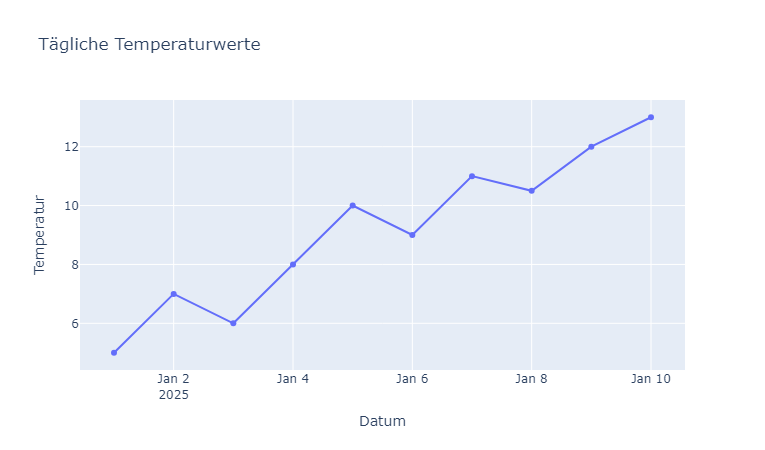
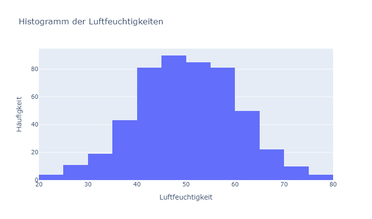
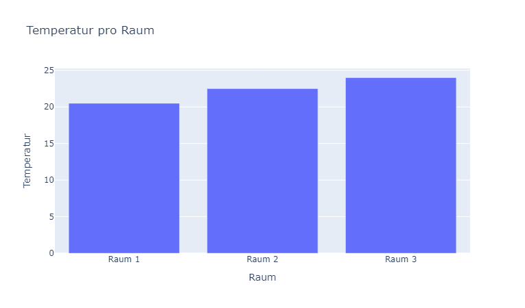
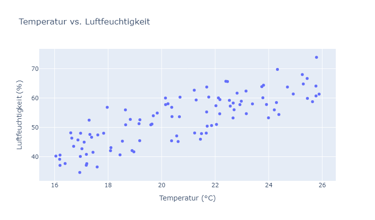

## Visualisierungen

Daten-Visualisierungen helfen, Muster, Ausreisser und Zusammenhänge in Daten schnell zu erfassen. Im Folgenden vier grundlegende Diagrammtypen:

1. **Line Plot (Linienplot)**
2. **Histogramm**
3. **Bar Plot (Balkendiagramm)**
4. **Scatter Plot (Punktwolke)**

---

### 1. Line Plot (Linienplot)

Ein Linienplot eignet sich besonders für **Zeitreihen** oder geordnete Daten, bei denen die x-Achse eine natürliche Reihenfolge (z. B. Zeitstempel) hat. Die Verbindung durch Linien betont Trends und Verläufe.

**Anwendungsfälle**

* Sensor- oder Messwerte über die Zeit
* Temperaturverlauf, Umsatzentwicklung

**Beispielcode**

```python
import pandas as pd
import plotly.graph_objects as go

# Pseudodaten: tägliche Temperaturwerte
dates = pd.date_range('2025-01-01', periods=10, freq='D')
temperature = [5, 7, 6, 8, 10, 9, 11, 10.5, 12, 13]
df = pd.DataFrame({'Datum': dates, 'Temperatur': temperature})

fig = go.Figure()
fig.add_trace(go.Scatter(x=df['Datum'], y=df['Temperatur'], mode='markers+lines'))

fig.update_layout(
    title='Tägliche Temperaturwerte',
    xaxis_title='Datum',
    yaxis_title='Temperatur'
)

fig.show()
```



---

### 2. Histogramm

Ein Histogramm zeigt die **Verteilung** einer numerischen Variable, indem es den Wertebereich in Intervalle („Bins“) unterteilt und die Häufigkeit der Werte in jedem Bin zählt.

**Anwendungsfälle**

* Verteilungen von Messwerten (z. B. CO₂-Konzentrationen, Testscores)
* Identifikation von Schiefe der Verteilung oder Ausreissern

**Beispielcode**

```python
import numpy as np
import plotly.graph_objects as go

data = np.random.normal(loc=50, scale=10, size=500)

fig = go.Figure(data=[go.Histogram(x=data, nbinsx=15)])

fig.update_layout(
    title='Histogramm der Luftfeuchtigkeiten',
    xaxis_title='Luftfeuchtigkeit',
    yaxis_title='Häufigkeit'
)

fig.show()
```


---

### 3. Bar Plot (Balkendiagramm)

Ein Bar Plot vergleicht **kategoriale** Werte oder aggregierte Grödden. Die x-Achse zeigt Kategorien, die y-Achse eine numerische Metrik (z. B. Mittelwerte, Summen).

**Anwendungsfälle**

* Durchschnittswerte pro Gruppe (z. B. Durchschnitts-CO₂ pro Raum)
* Summen, Zählungen je Kategorie (z. B. Anzahl Messwerte pro Raum)

**Beispielcode**

```python
import pandas as pd
import plotly.graph_objects as go

# Beispiel für Temperaturdaten pro Raum
data = {'Raum': ['Raum 1', 'Raum 2', 'Raum 1', 'Raum 2', 'Raum 3'],
        'Temperatur': [20, 22, 21, 23, 24]}
temp_df = pd.DataFrame(data)

# Berechnung der durchschnittlichen Temperatur pro Raum
average_temp = temp_df.groupby('Raum')['Temperatur'].mean().reset_index()

fig = go.Figure(data=[go.Bar(x=average_temp["Raum"], y=average_temp["Temperatur"])])

fig.update_layout(
    title='Temperatur pro Raum',
    xaxis_title='Raum',
    yaxis_title='Temperatur'
)

fig.show()
```


---

### 4. Scatter Plot (Punktwolke)

Ein Scatter Plot zeigt die Beziehung zwischen **zwei numerischen** Variablen als Punktwolke. Er hilft, **Zusammenhänge**, Cluster und Ausreisser zu erkennen.

**Anwendungsfälle**

* Korrelation zwischen zwei Merkmalen
* Zusammenhang mit dem Auge abschätzen

**Beispielcode**

```python
import numpy as np
import pandas as pd
import plotly.graph_objects as go

# Pseudodaten: zwei numerische Merkmale
np.random.seed(0)
x = np.random.uniform(0, 10, size=100) + 16    # z. B. Temperatur
y = 2.5 * x + np.random.normal(0, 5, size=100) # z. B. Luftfeuchtigkeit

df = pd.DataFrame({'Temperatur': x, 'Feuchtigkeit': y})

fig = go.Figure(data=[go.Scatter(x=df['Temperatur'], y=df['Feuchtigkeit'], mode='markers')])

fig.update_layout(
    title='Temperatur vs. Luftfeuchtigkeit',
    xaxis_title='Temperatur (°C)',
    yaxis_title='Luftfeuchtigkeit (%)'
)

fig.show()
```



---

## Zusammenfassung

| Diagramm     | Zweck                                    |
| ------------ | ---------------------------------------- |
| Line Plot    | Trends und Verläufe über geordnete Daten |
| Histogramm   | Verteilung einer einzelnen Variable      |
| Bar Plot     | Vergleich zwischen Gruppen               |
| Scatter Plot | Beziehung/Korrelation zwischen Merkmalen |

